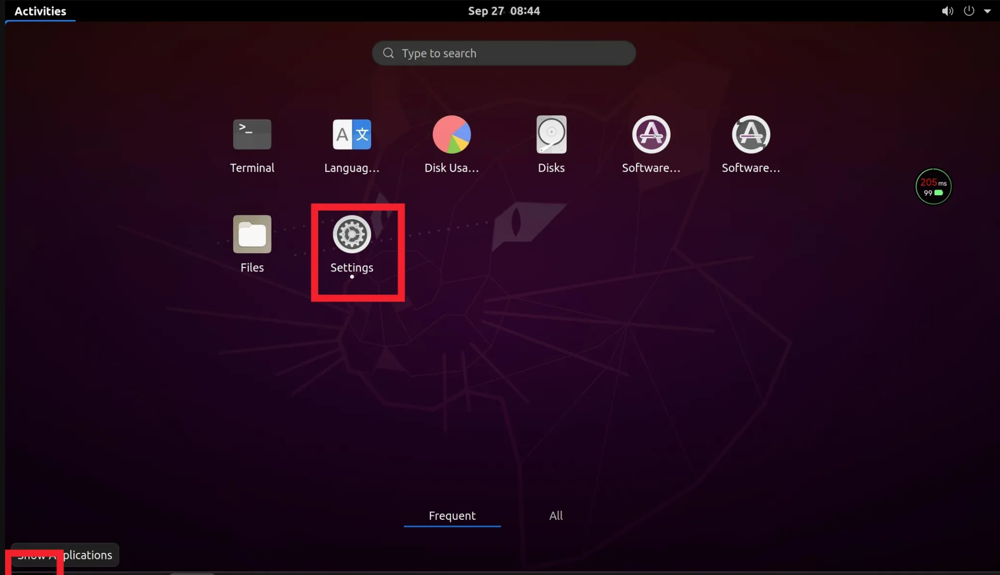
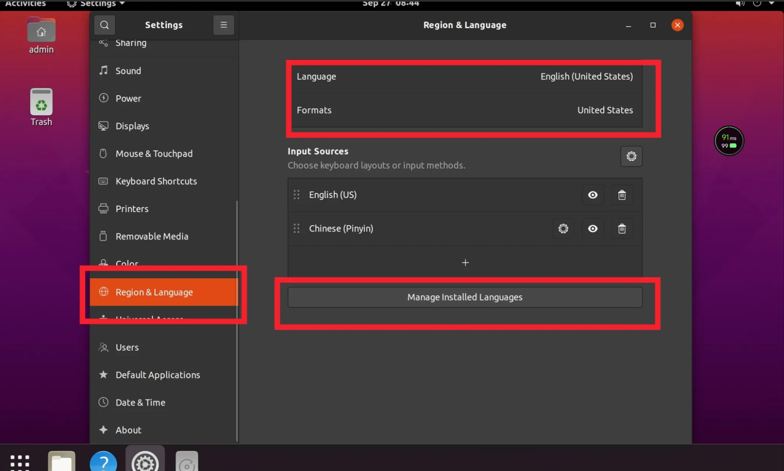
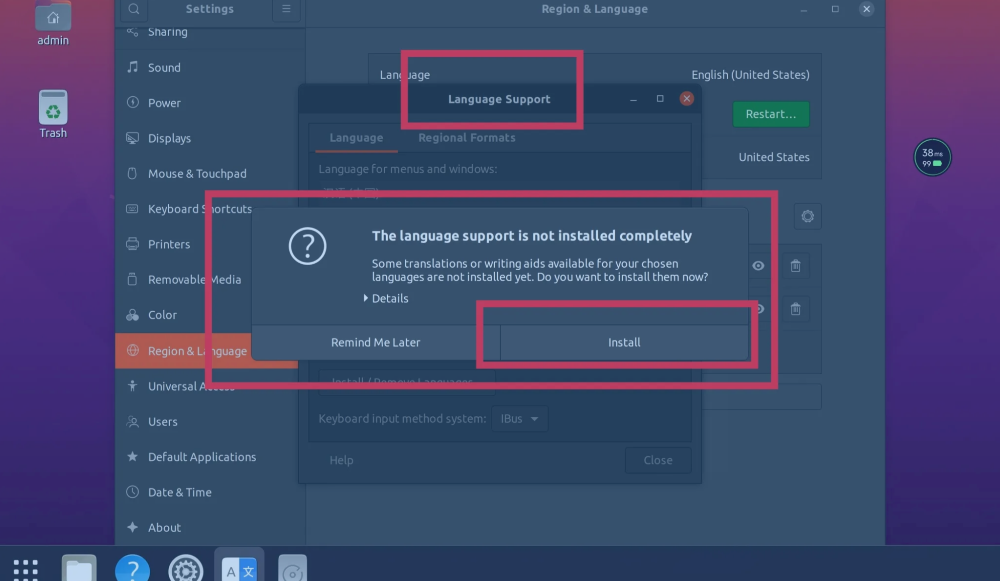

Title: 无影云电脑个人版升级Ubuntu24.04
Date: 2026-06-19 21:22
Category: 技术
Tags: 阿里云, 无影云电脑, Ubuntu


## 无影云电脑简介

阿里云推出无影云电脑个人版，其主要面向还是游戏方面，像VPS，不过不给公网ip，像网吧的系统，不过设备另外购买，阿里云给出安装好《黑悟空神话》等镜像。云主机分镜像提供了不同规格。

## 规格价格

规格如下：

| 模式名称 | 经济模式   | 流畅模式   | 性能模式    | 电竞模式                            |
| -------- | ---------- | ---------- | ----------- | ----------------------------------- |
| CPU      | 4核心      | 8核心      | 16核心      | 12核心                              |
| 内存     | 8GiB       | 16GiB      | 32GiB       | 46Gib                               |
| 费率     | 4核时/小时 | 8核时/小时 | 16核时/小时 | 60核时/小时                         |
| 显卡     |            |            |             | Nvidia Geforce RTX 2080Ti Super 8Gb |
|          |            |            |             | 仅限Windows Server系统              |

同时其根据价格提供不同数据盘大小（系统盘统一为60G）和网络速率(默认为10Mbps)配置

|        | 数据盘大小 | 赠送核时/月 | 价格                                        |
| ------ | ---------- | ----------- | ------------------------------------------- |
| 黄金版 | 40G        | 40          | 9.9/连续包月 27.9/连续包季99.9/连续包年     |
| 白金版 | 100G       | 80          | 19.9/连续包月 57.9/连续包季199.9/连续包年   |
| 铂金版 | 200G       | 160         | 29.9/连续包月 84.9/连续包季319.9/连续包年   |
| 钛金板 | 500G       | 320         | 74.9/连续包月 209.9/连续包季749.9/连续包年  |
| 黑金版 | 1000G      | 640         | 139.9/连续包月 389.9/连续包季1399.9连续包年 |

| 网速   | 价格 |
| ------ | ---- |
| 10Mbps | 默认 |
| 20Mbps | ？   |
| 30Mbps | ？   |
| 40Mbps | ？   |

从目前的状况来看，无影云电脑配置较部分本地旧电脑高，适合电脑不在身边时带着平板使用，但平板还必须配有键盘鼠标，才方便使用，或者就是轻薄本玩游戏，也是挺好的。

## 系统介绍

无影云电脑从版本记录来看，企业版功能比个人版功能多，系统镜像多，企业版提供Windows 11、centos、Ubuntu24.04等多样化系统，而个人版只支持4款系统

* Windows Server 2022 Datacenter
* ~~Ubuntu 20.04~~ (已删除)
* Ubuntu 22.04(后期才增加的)
* Kylin 23.04(后期才增加的)

毕竟Windows 系统千篇一律，我想在Ubuntu系统上面玩玩。但是本人喜新厌旧，当时用的时候居然只有Ubuntu 20.04,虽说是LTS系统，但主流支持也仅仅到2025年。我开始想升级Ubuntu系统，发现无影云电脑其使用的远程连接协议比较特殊，是私有的ASP协议，不是主流的VNC或是RDP，同时无法出现系统初始化界面，用户登录界面等配置界面，不告知密码，无法通过系统设置修改密码。不过ssh倒是配置了免密，sudo -i 也没有限制使用。

## 安装步骤

### 1.安装中文语言包

那就开始我们的折腾吧。经过我多次尝试，我使用了Ubuntu 20.04 作为初始系统。

为什么不选择Ubuntu 22.04呢，我最开始尝试的时候无影云没有推出这个系统，~~推出22.04后我实验了一下，Ubuntu镜像源有问题，无法升级。~~（可使用，无法升级是设置了某些软件不升级）

在打开Ubuntu 20.04后首先第一件事安装中文语言包。（毕竟是中国人，看中文最舒服）

1.点击左下角或者左上角的九宫格图标，打开所有应用。


2.打开Settings

3.点击 Region&Language。



4.点击language，选择中文，Done

5.点击Formats,选择中国，Done

6.点击Manage Install Language,会跳出来The language surpport is not installed completely，点击Install，此时会自动安装。安装以后点击Install/removed language，取消勾选English。全部OK





7.关闭所有页面后重启电脑，云电脑连接后应该显示中文。此时全部结束。

QA:

Q:如果此时提示输入密钥：

A:请自行设置密钥，并牢记密钥。以后安装部分软件可能需要。

Q：如果此时提示输入密码：

A:请直接取消，无影云电脑个人版不提供密码给你。请打开终端（Terminal）输入

```
bash
sudo chattr -i /etc/passwd
sudo chattr -i /etc/shadow
sudo passwd admin

# 输入新的密码（此密码可能会随着系统重启而被更改）
```


接下来继续之前的操作。

为什么要这么做呢，因为阿里云在其官方常见问题中提到了一点就是默认在shadow和passwd上加锁，所以无法轻易更改密码。


### 2.升级软件

继安装完中文语言包并重启后，我们开始升级系统的流程了。我们选择官方的do-release-upgrade命令升级。

在升级系统之前，我们要升级系统内软件包。

打开终端，输入如下命令，先更新软件包缓存。

```bash
sudo apt update
sudo apt-mark unhold linux-generic linux-head-generic linux-image-generic
# 这三个包是系统内核，默认不升级，但不升级内核就无法升级系统。
sudo apt upgrade -y

```

安装一会儿会遇到是否升级软件配置文件，我选择的是install package maintainer’s version

安转完成后输入命令重启电脑

```bash
sudo reboot
```

### 3.升级Ubuntu 22.04/24.04

系统重启后我们继续在终端输入

```bash
sudo chattr -i /etc/passwd
sudo chattr -i /etc/shadow

sudo do-release-upgrade
```

此时会提示，在/etc/update-manager/release-upgrade中设置的是never，永不升级。

我们编辑一下

```bash
sudo nano /etc/update-manager/release-upgrade
```

将never改成lts，ctrl + o 保存， ctrl + x 离开。

接下来继续运行

```bash
sudo do-release-upgrade
```

接下来会选择是否继续升级，输入y

是否保持软件默认设置，我选择了还是install package’s main version

会遇到两次变紫色画面，输入Ubuntu系统域名等，直接默认回车。

等一段时间，在更新时，系统会提示有新系统更新，是否更新，选择稍后。

等到最后会提示大量软件包不再需要，可以删除，删除后重启，此时已经是Ubuntu22.04.5 LTS系统。

### 4.加快系统更新的方法

在系统更新的时候，有一段时间会让人感觉卡住了，就是安装libreoffice，firefox等软件，因为从Ubuntu 22.04开始，gnome 桌面、Firefox、 libreoffice等一系列的软件都换成了snap软件包。

而阿里云也罢，国内各大高校也罢，有Ubuntu软件镜像源，但是没有snap镜像源。网上提出一种方法，就是安装snap官方镜像包，但是这能不能加速，也是仁者见仁智者见智。

```bash
snap install snap-proxy
snap install snap-proxy-client
```

我选择，反正firefox占有量也很低，我用的也是Microsoft Office 365，所以我用FIrefox 下载了Microsoft Edge 浏览器，然后干脆把firefox 删掉了。

可以删掉的软件很多。

```bash
sudo apt remove libreoffice* firefox* reminna* transmission* thunderbird*
```

thunderbird 是邮件软件，transmission是下载软件，Remmina 是远程桌面共享，大多是都没用。

## 升级Ubuntu24.04的注意事项

### 更新软件包格式

升级Ubuntu24.04系统后其他倒没什么，但是有一点要注意的。很多开源镜像都提醒了

> 在 Ubuntu 24.04 之前，Ubuntu 的软件源配置文件使用传统的 One-Line-Style，路径为 `/etc/apt/sources.list`；从 Ubuntu 24.04 开始，Ubuntu 的软件源配置文件变更为 DEB822 格式，路径为 `/etc/apt/sources.list.d/ubuntu.sources`。

在无影云电脑中还不一样，用的是阿里云镜像，其没有放在ubuntu.sources文件中，而是在

`/etc/apt/sources.list.d/third-party.sources`文件中。

当我们在运行软件更新时会提示warning，是因为这个文件缺少了最后验证的gpg文件路径。

我们编辑一下 `/etc/apt/sources.list.d/third-party.sources`这个文件。

```bash
sudo nano /etc/apt/sources.list.d/third-party.sources
```

最后一行加上

```bash
Signed-By: /usr/share/keyrings/ubuntu-archive-keyring.gpg
```

保存以后再更新就一切正常了。
